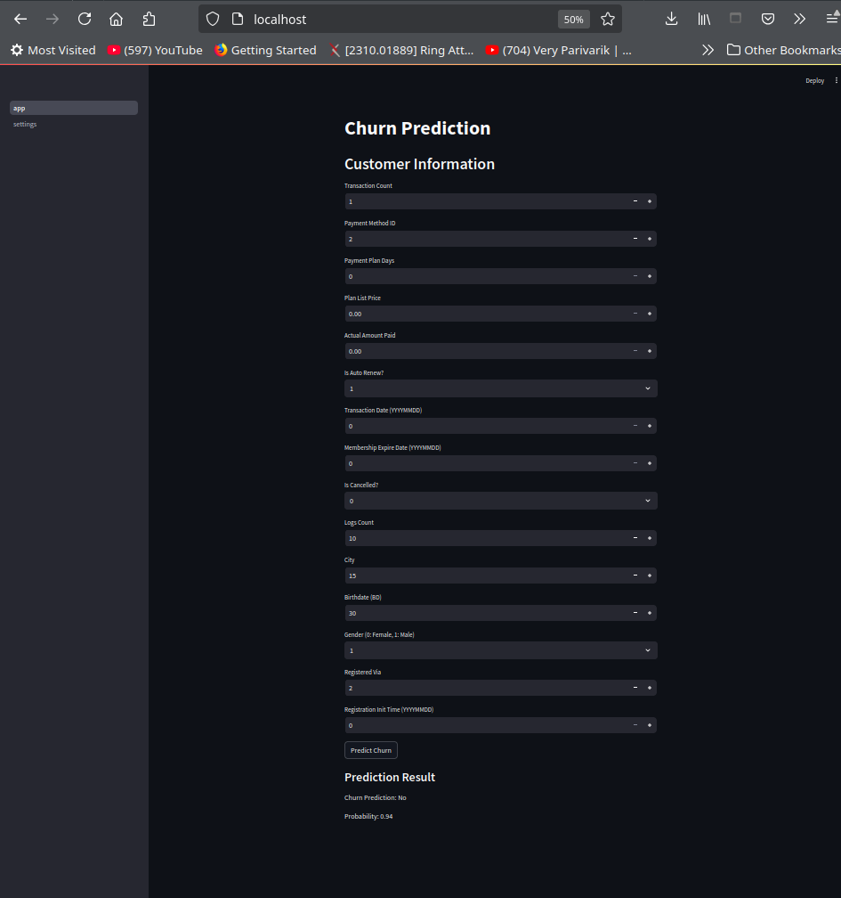

# Predicting Customer Churn for Music streaming service

## Index

- [Problem Description](#problem-description)
- [Dataset Description](#dataset-description)
- [Data Extraction and Challenges](#data-extraction-and-challenges)
- [Dataset Setup](#dataset-setup)
- [Dataset Directory](#dataset-directory)
- [Project Directory](#project-directory)

- [Steps for Running Model Development Scripts](#steps-for-running-model-development-scripts)

- [Instructions for Running the Application](#instructions-for-running-the-application)

- [Model Evaluation](#model-evaluation)
- [Docker Kubernetes Deployment](#docker-kubernetes-deployment)
- [Further Development](#further-development)

- [Project Evaluation](#project-evaluation)

---


## Problem Description

In the highly competitive subscription-based music streaming industry, customer churn poses a significant challenge. **Churn** refers to customers not renewing or actively canceling their subscriptions. This issue is critical because retaining existing customers is often more cost-effective than acquiring new ones, and it directly impacts a company’s revenue and growth potential.

The primary objective of this project is to predict whether a user will churn after their subscription expires. Accurately forecasting churn allows streaming platforms to implement proactive retention strategies such as personalized offers, improved customer support, or tailored recommendations. These strategies can help reduce revenue loss and enhance customer lifetime value.

By solving this problem, we aim to assist music streaming services in:
- Identifying customers at risk of churning.
- Gaining insights into user behavior and churn patterns.
- Enabling data-driven decisions to optimize customer retention efforts.

This predictive model will provide actionable insights to empower business teams in reducing churn rates and driving sustainable growth.

## Dataset Description

The dataset used for this project is sourced from the [KKBOX Churn Prediction Challenge on Kaggle](https://www.kaggle.com/competitions/kkbox-churn-prediction-challenge/data). KKBOX is a subscription-based music streaming service where users can choose between manual and auto-renew options and cancel subscriptions at any time.

**Key aspects of the dataset:**

- **Target Variable:**
  - `is_churn`: Indicates whether a user did not renew their subscription within 30 days of expiration. (`is_churn = 1` means churn; `is_churn = 0` means renewal).

- **Dataset Timeframes:**
  - The training data includes users whose subscriptions expired in February 2017, with churn predictions focused on March 2017.
  - The test data includes users whose subscriptions expired in March 2017, with predictions focused on April 2017.

- **Churn Definition Nuances:**
  - Churn is defined as the absence of a valid new subscription within 30 days of the current membership's expiration.
  - Active cancellations do not necessarily imply churn; users may cancel subscriptions to switch plans or for other reasons but still renew later.

**Key Files in the Dataset:**

1. **train.csv / train_v2.csv**
   - User IDs and churn status (target variable).
2. **sample_submission_zero.csv / sample_submission_v2.csv**
   - Test set containing user IDs and expected churn predictions.
3. **transactions.csv / transactions_v2.csv**
   - User transaction details, including payment methods, plan prices, and cancellation statuses.
4. **user_logs.csv / user_logs_v2.csv**
   - Daily listening behaviors, including the number of songs played, unique songs, and total playtime.
5. **members.csv / members_v3.csv**
   - User demographic information such as age, gender, and registration details.

The dataset also includes a churn labeling script (`WSDMChurnLabeller.scala`) to generate churn labels for the user data. This script facilitates the creation of custom training datasets by applying consistent churn definitions.

## Data Extraction and Challenges

One of the key challenges in this project is understanding the intricacies of KKBOX’s subscription model, such as:
- Handling cases where users change their subscription plans.
- Identifying active cancellations versus churn.
- Managing outliers in user demographics (e.g., unrealistic age values).

The dataset provides rich transactional and behavioral data, allowing us to explore diverse features and model customer behavior effectively.

## Dataset Setup

The dataset can be downloaded using the following Kaggle command:

```bash
kaggle competitions download -c kkbox-churn-prediction-challenge
```

## Dataset Directory
Download and organize the dataset as follows:
```
/data  
    members_v3.csv  
    sample_submission_v2.csv  
    sample_submission_zero.csv  
    train.csv  
    train_v2.csv  
    transactions.csv  
    transactions_v2.csv  
    user_logs.csv  
    user_logs_v2.csv  
```

## Project Directory
```
/notebooks  
    /eda  
        eda_dask4.ipynb       # Exploratory Data Analysis notebook  
    /modeling  
        train_v3.ipynb        # Model training notebook  
        train_v4.ipynb        # Notebook with separate training and test data across months  
        train_v5_1.py         # Feedforward Neural Network model training script  
        train_v5_2.py         # Hyperparameter tuning script  

/services  
    /churn_prediction  
        /api                  # API code for churn prediction  
        /test                 # API unit testing scripts  
    /frontend                 # Streamlit application to consume the API  
```

## Steps for Running Model Development Scripts

### 1. **Set Up the Environment**

1.1 **Create a Virtual Environment**  
   Run the following command to create a virtual environment. Replace `myenv` with your desired environment name:  
   ```bash
   python -m venv myenv
   ```

1.2 **Activate the Virtual Environment**  
   - **On Windows**:  
     ```bash
     myenv\Scripts\activate
     ```  
   - **On macOS/Linux**:  
     ```bash
     source myenv/bin/activate
     ```

1.3 **Install Dependencies**  
   Install the required packages by running:  
   ```bash
   pip install -r notebooks/requirements.txt
   ```

1.4 **(Optional) Register Kernel for VS Code**  
   To register the virtual environment as a Jupyter kernel for VS Code, use:  
   ```bash
   python -m ipykernel install --user --name=myenv --display-name "Python (myenv)"
   ```

---

### 2. **Prepare the Dataset**

2.1 **Download Dataset Files**  
   Place the required dataset files in the `/data` directory. Ensure all files are correctly named and formatted as per project requirements.  

2.2 **Update File Paths**  
   Verify and update the file path variables in the notebooks or scripts to point to the `/data` directory.

---

### 3. **Exploratory Data Analysis (EDA)**

3.1 **Navigate to the EDA Folder**  
   Change to the directory where the EDA notebooks are located:  
   ```bash
   cd notebooks/eda
   ```

3.2 **Run the EDA Notebook**  
   Open and execute the notebook `eda_dask4.ipynb` to perform Exploratory Data Analysis:  
   ```bash
   jupyter notebook eda_dask4.ipynb
   ```

---

### 4. **Train the Model**

4.1 **Navigate to the Modeling Folder**  
   Switch to the directory containing the modeling scripts and notebooks:  
   ```bash
   cd notebooks/modeling
   ```

4.2 **Run the Model Training Scripts**  
   Depending on your requirements, use one of the following options:  

   - **General Model Training**:  
     Open and run `train_v3.ipynb` for basic model training:  
     ```bash
     jupyter notebook train_v3.ipynb
     ```  

   - **Training with Separate Monthly Data**:  
     Use `train_v4.ipynb` for training and testing models with monthly data:  
     ```bash
     jupyter notebook train_v4.ipynb
     ```  

   - **Feedforward Neural Network**:  
     Execute `train_v5_1.py` for training a Feedforward Neural Network:  
     ```bash
     python train_v5_1.py
     ```  

   - **Hyperparameter Tuning**:  
     Run `train_v5_2.py` for hyperparameter tuning:  
     ```bash
     python train_v5_2.py
     ```


## Instructions for Running the Application  

### 1. Download and Add the Model  
- Download the model file from the release section.  
- Add the downloaded model file to the following directory:  
  ```  
  services/churn_prediction/api/models  
  ```  

### 2. Update the Model Path  
- Update the `MODEL_FILE` variable in the API code `services/churn_prediction/api/api.py` to point to the path of the downloaded model file.  
### 3. Running the application

This project provides 3 ways of running the applicaiton
1. using docker compose
2. using python virtual env
3. kubernete using kind (refer to [Docker Kubernetes Deployment](#docker-kubernetes-deployment))

#### 3.1 Using Docker compose
#### 3.1.1. Run docker compose
Install docker and docker compose

#### 3.1.2. Run docker compose
```bash
docker-compose up
```
#### 3.2 Running directly
#### 3.2.1. Install Dependencies  

- Install the necessary dependencies for both the API and frontend.  
- **For the API**:  
   Navigate to the `/services/churn_prediction/api` directory and install the dependencies from `requirements.txt`:  
   ```  
   cd services/churn_prediction/api  
   pip install -r requirements.txt  
   ```  
- **For the Frontend**:  
   Navigate to the `/services/churn_prediction/frontend` directory and install the dependencies from `requirements.txt`:  
   ```  
   cd services/churn_prediction/frontend  
   pip install -r requirements.txt  
   ```  

#### 3.2.2. Run API and Frontend  

##### **API**  
1. Navigate to the API directory:  
   ```  
   cd services/churn_prediction/api  
   ```  
2. Run the API server using the following script:  
   ```  
   ./run.sh  
   ```  

##### **Testing**  
- The API testing scripts are located in the `/services/churn_prediction/test` directory.  
- To run the unit tests, execute the following command from the `services/churn_prediction` directory:  
  ```  
  pytest  
  ```  

##### **Frontend**  
1. Navigate to the frontend directory:  
   ```  
   cd services/frontend  
   ```  
2. Run the Streamlit application using the following script:  
   ```  
   ./run.sh  
   ```  
## Running application



## Model Evaluation

```

report

-- Mean Baseline -- 
Train Accuracy: 0.9361
Train Log Loss: 0.2376
Test Accuracy: 0.9101
Test Log Loss: 0.3075

-- Feed Forward Network -- 
Train Accuracy: 0.9668
Train Log Loss: 0.0765
Test Accuracy: 0.9399
Test Log Loss: 0.3268

-- Decision Tree -- 
Train Accuracy: 0.0639
Train Log Loss: 0.0765
Test Accuracy: 0.0899
Test Log Loss: 0.3268

-- LightGBM --
Train Accuracy: 0.9698
Train Log Loss: 0.0628
Test Accuracy: 0.9387
Test Log Loss: 0.3480

-- XGBoost -- 
Train Accuracy: 0.9694
Train Log Loss: 0.0689
Test Accuracy: 0.9396
Test Log Loss: 0.3430

-- Hyper parameter Tunned LightGBM --
Train Log Loss: 0.0612
Test Log Loss: 0.3646
```

## Docker Kubernetes Deployment

### Deployment

To deploy the application using Docker and Kubernetes, follow the steps below:

#### Prerequisites

Before proceeding with the deployment, ensure that you have the following tools installed:

- [Docker](https://www.docker.com/)
- [Kind](https://kind.sigs.k8s.io/) (Kubernetes in Docker)
- [make]
#### Deployment Steps

1. **Install Required Tools**

   Make sure you have Docker and Kind installed on your machine.

2. **Initialize Kind Cluster**

   Run the following command to initialize the Kind cluster:

   ```bash
   make kind-init
   ```

3. **Deploy All Development Services**

   Deploy all the necessary development services by executing the following command:

   ```bash
   make dev_deploy_all
   ```

4. **Test the API**

   Wait for both api and frontend to be in running state. 
   Check using 
   ```bash
   kubectl get po
   ```
   Run integration tests to ensure the API is functioning correctly:
   (make sure virtul env is active and pytest is installed)
   ```bash
   make dev_api_integation_test
   ```
5. **Access the Application**

   After deployment, you can access the application at: [http://localhost](http://localhost)
   
   If you encounter any issues while making predictions, please check the settings page for further troubleshooting.

6. **Delete the Cluster**

   To delete the Kind cluster and clean up resources, run:

   ```bash
   make kind-delete
   ```
#### Development Steps
- [TODO]: how to build images and update manifest using make commands


## Further Development

Future work could include:

* Tunning machine learning models
* Exploring more advanced machine learning models.
* Model explaination
* Model monitoring 
* CICD pipeline


# Project Evaluation  
```
## Problem Description  
- [x] Problem is described in README with enough context, so it's clear what the problem is and how the solution will be used  

## EDA  
- [x] Extensive EDA (ranges of values, missing values, analysis of target variable, feature importance analysis)  

## Model Training  
- [x] Trained multiple models and tuned their parameters. For neural networks: same as previous, but also with tuning: adjusting learning rate, dropout rate, size of the inner layer, etc.  

## Exporting Notebook to Script  
- [x] The logic for training the model is exported to a separate script  

## Reproducibility  
- [x] It's possible to re-execute the notebook and the training script without errors. The dataset is committed in the project repository or there are clear instructions on how to download the data  

## Model Deployment  
- [x] Model is deployed (with Flask, BentoML or a similar framework)  

## Dependency and Environment Management
- [x] Provided a file with dependencies and used virtual environment. README says how to install the dependencies and how to activate the env  

## Containerization  
- [x] The application is containerized and the README describes how to build a container and how to run it  

## Cloud Deployment  
- [x] Docs describe clearly (with code) how to deploy the service to cloud or Kubernetes cluster (local or remote)  
- [x] There's code for deployment to cloud or Kubernetes cluster (local or remote). There's a URL for testing - or video/screenshot of testing it  
```